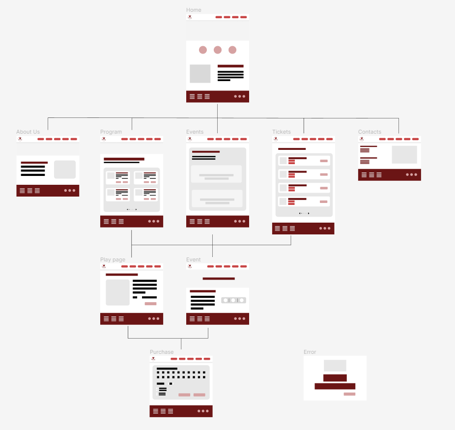
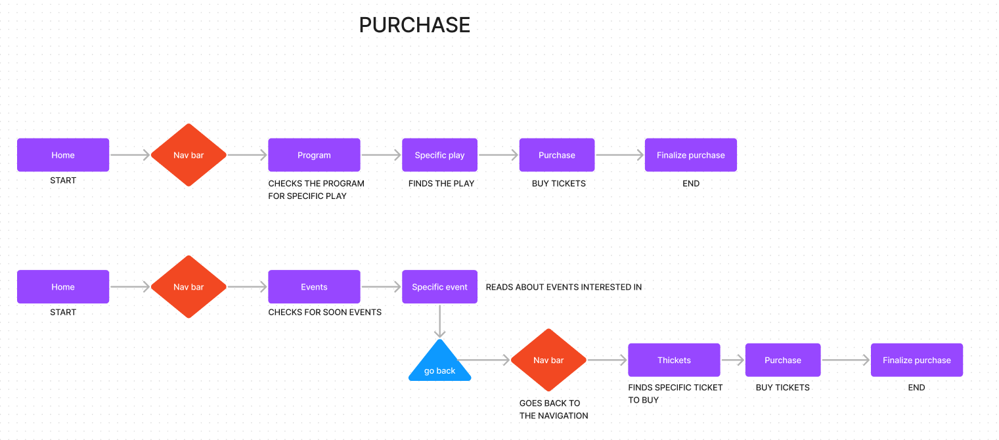
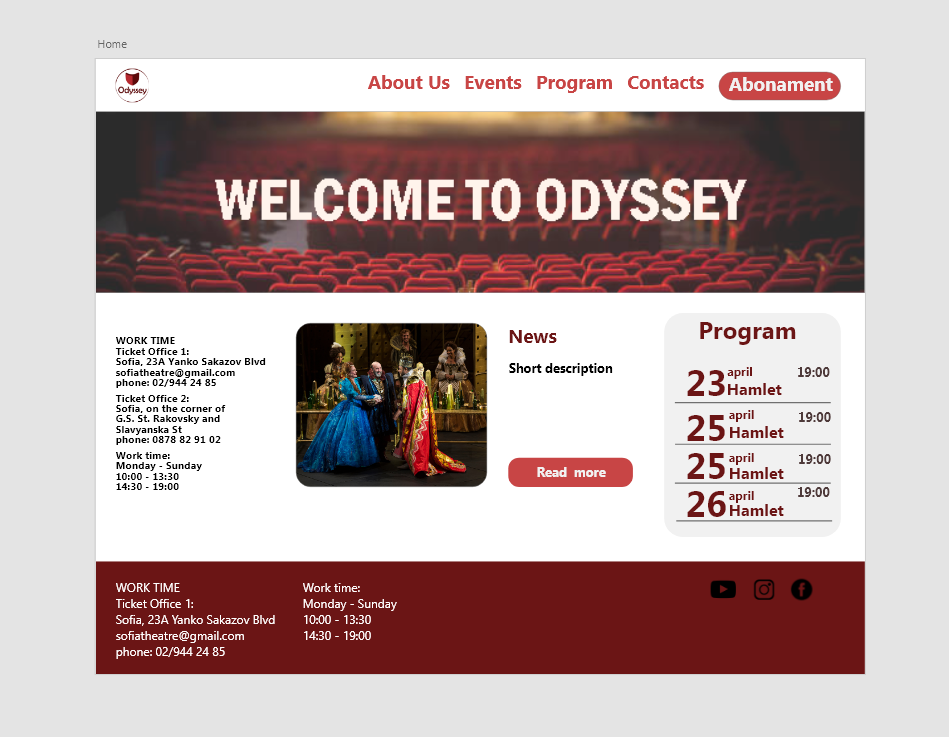

# Odyssey-theater

### Description
Theater website which offer comfortable play and events schedule and an easy way to buy 
tickets online.
## technical documentation
### UX wireframe
-later will be updated

### Site map

### UX user flow

### Home page documentation

Divide your content into header, main and footer tags. Use #6B1515 for header and footer color. 
Header contains the logo which is 50% rounded and the menu options. To create  the header menu options use ul li a tags.
Use #C84545 color for the text. Put The Abonament option a button and use color #F1F1F1 and button color , rounded 50%.
* The button should have the following properties:
        * Font size - **26px**
        * Background - **#C84545**
        * Border width - **2px**
        * Color - **#F1F1F1**
        * Border style - **solid** **#C41313**
        * Hover effect *(look at the screenshots)* -#E57C7C

Now for the body of the site 

* Use **section** tag to create three **sections** inside the main.
In the first one we put only text. Next Is the News article where we have an image, a button and text with title and description. Finally the sidebar contains infornmation about the program in the current month.
Every title is #6B1515 color including the date in the program sidebar.